If you never heard about Vue.js or use it befor, you are probably thinking: Oh my God! another javascript framework! what the hell is going on, well in fact the first release of Vue is was in 2014. 

Vue is light and fast javascript framework, it's easy to learn, focused on the view layer, and is very easy to pick up and integrate with other libraries or existing projects  On the other hand, Vue is also perfectly capable of powering sophisticated Single-Page Applications when used in combination with modern tooling and supporting libraries.

In this post I am going to guide on how use Vue.js based application using visual studio.

if you don't already have visual studio you can download free version of visual studio [https://www.visualstudio.com/vs/community/](https://www.visualstudio.com/vs/community/).

## What is Vue.js? 

Vue.js is a progressive framework for building user interfaces. Unlike other monolithic frameworks, Vue is designed from the ground up to be incrementally adoptable. The core library is focused on the view layer only, and is very easy to pick up and integrate with other libraries or existing projects. On the other hand, Vue is also perfectly capable of powering sophisticated Single-Page Applications when used in combination with modern tooling and supporting libraries.


## Create a Empty ASP.NET project? 
let's first create an empty web application, launch visual studio and create a new asp.net application: 

- Click New Project in the Start page or in the File menu.

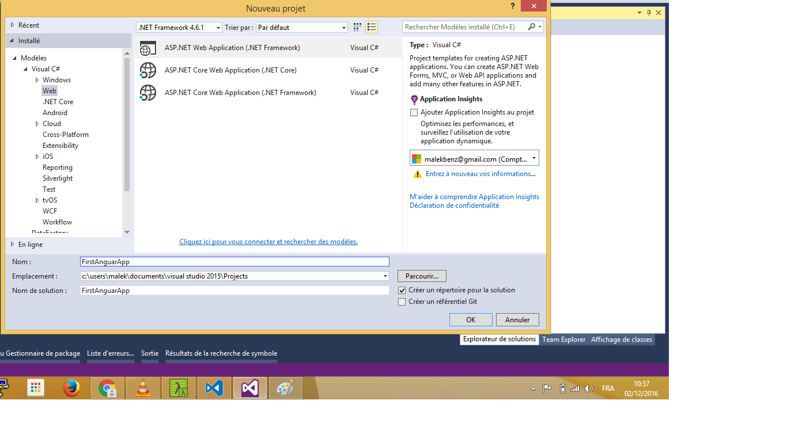{:class="img-responsive" }

- In the New Project dialog, click Web in the left pane and ASP.NET Web Application in the middle pane.

Specify project Name `firstApp`, Location, and other options, and then click OK.

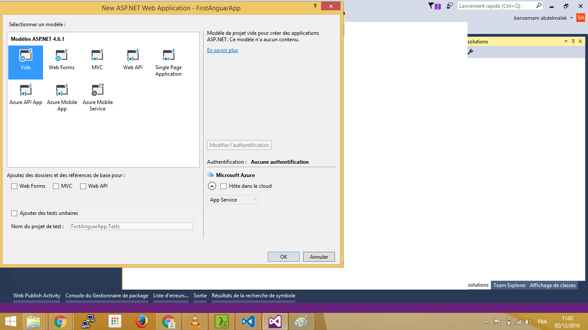{:class="img-responsive" }

- The New ASP.NET Project dialog appears Click a empty template , and then click OK.

Now create a new folder `app` and add new html page `index.html`:  

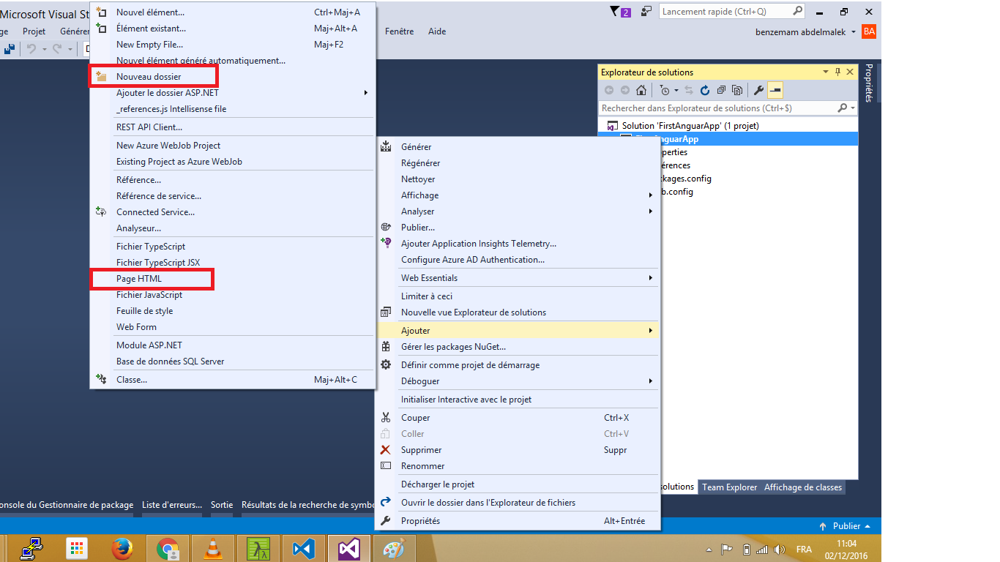{:class="img-responsive" }

update `index.html` : 

```
    <!DOCTYPE html>
    <html>
    <head>
        <meta http-equiv="Content-Type" content="text/html; charset=utf-8" />
        <title></title>
        <meta charset="utf-8" />
    </head>
    <body ng-app="app">
        <h1>My first Vue.js application with visual studio</h1>

    </body>

    </html>
  
```

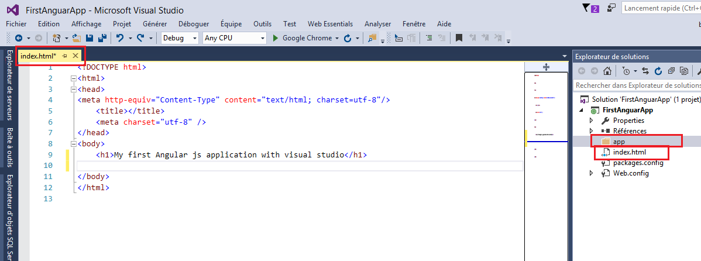{:class="img-responsive" }

this is a simple web application.

## But what about Angularjs :

Now it's time for `angularjs`, in order to use `angularjs` we have first to go to [angularjs web site ](https://angularjs.org/)  

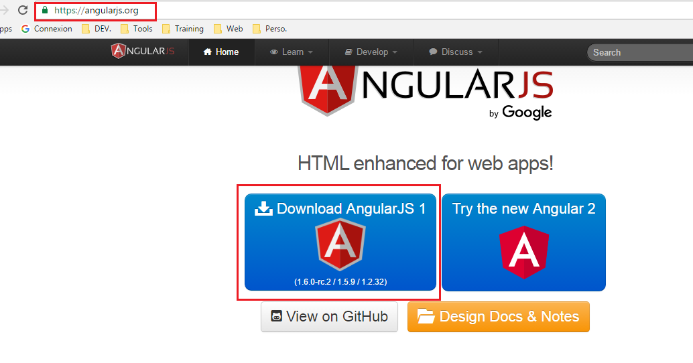{:class="img-responsive" }

and download by clicking `download` `angularjs 1` : 

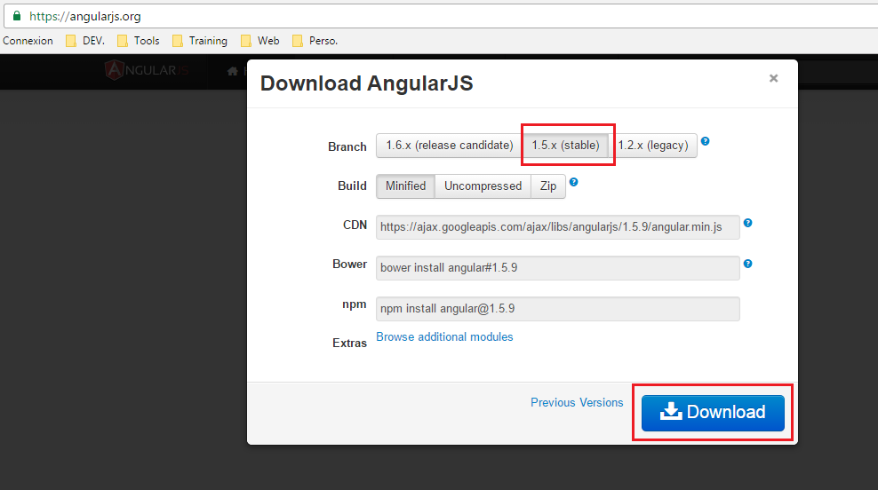{:class="img-responsive" }

Select `1.5x stable `  and click `download`, and copy `angular.min.js` to the `app` folder 

Update index.html : 

```
<body ng-app="app">
    <h1>My first Angular js application with visual studio</h1>

    <div ng-controller="booksController">
        Select a title: <input type="text" ng-model="title" />
        
        book title is : {{title}}
    </div>

    <script src="app/angular.min.js"></script>
    <script>
        app = angular.module("app",[]);
        app.controller("booksController", fnbooksController);

        function fnbooksController($scope) {
            $scope.title = "Learn angularjs";

        }
    </script>
</body>

```

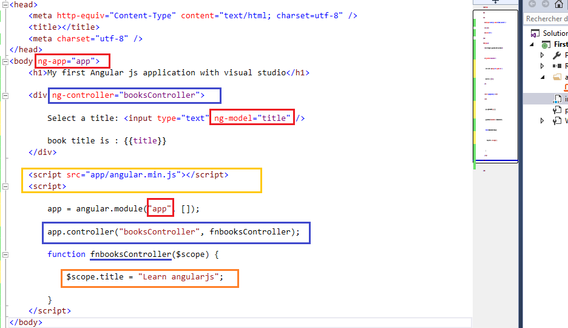{:class="img-responsive" }

Run the app and you should see something like: 

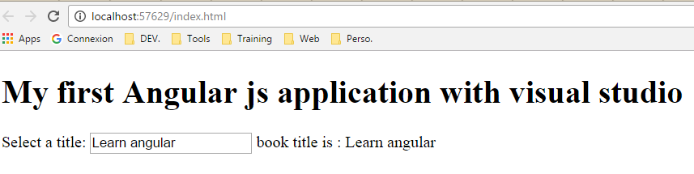{:class="img-responsive" }

## How to use `ng-repeat` directive: 

`ng-repeat` directive is used to iterate over an array or the properties of an object, let's add to our `booksController` an array of books: 
  
```
        function fnbooksController($scope) {

            $scope.title = "Learn angularjs";
            $scope.books = [
                { id: 1, title: "Learn asp.net" },
                { id: 2, title: "Learn javascript" },
                { id: 3, title: "Learn angularjs" },
                { id: 4, title: "Learn nodejs" }
            ];

        }

```

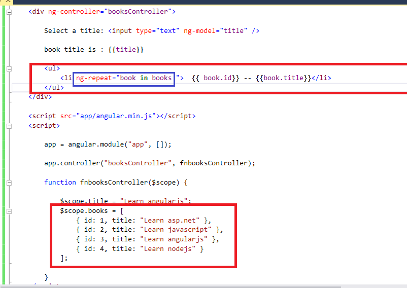{:class="img-responsive" }

```
        <ul>
            <li ng-repeat="book in books">  {{ book.id}}   {{book.title}}</li>
        </ul>

```
Run the app: 

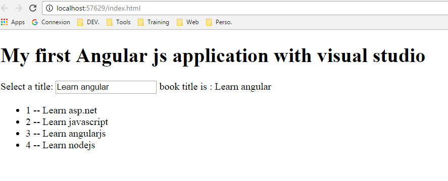{:class="img-responsive" }

## Filter: 

now let's add some Filter to add a search functionality, update `index.html` 

```
        <ul>
            <li ng-repeat="book in books | filter: title">  {{ book.id}}   {{book.title}}</li>
        </ul>

```


Run the app: 

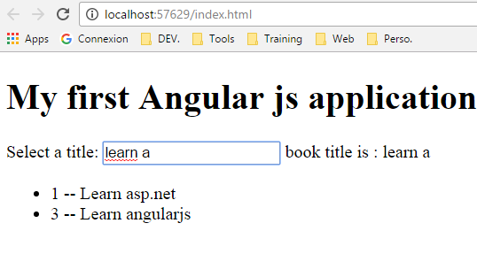{:class="img-responsive" }


>
> ## Congratulations!.
>